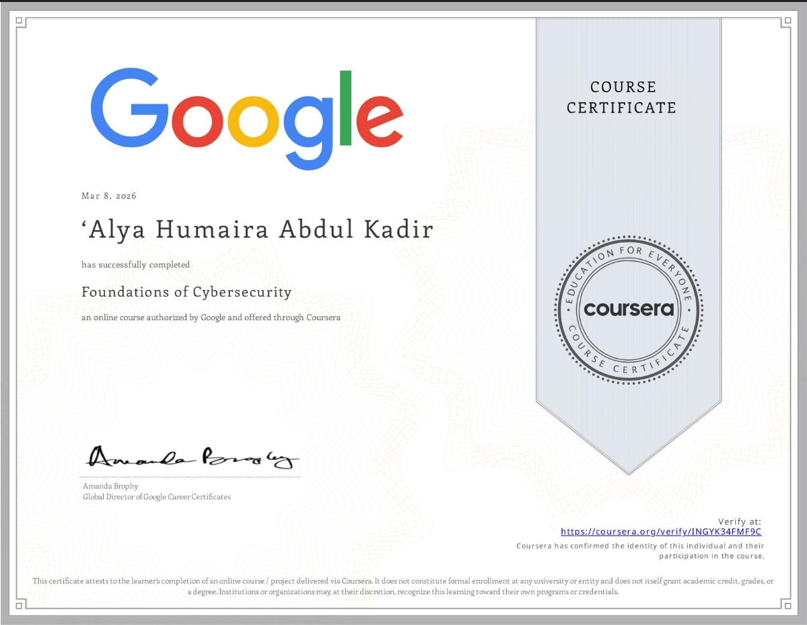

# Google Cybersecurity – Foundations of Cybersecurity

This certificate is part of the Google Cybersecurity Professional Certificate program.

---

## 📜 Certificate Preview

---

## 🔗 View Full Certificate

[Click here to view the PDF](../assets/Foundations%20of%20Cybersecurity%20Certificate.pdf)

---

## 🧠 Skills Learned

- Cybersecurity fundamentals  
- Security principles (CIA Triad)  
- Threats, vulnerabilities, and risks  
- Security frameworks and best practices  

---

## 🎯 Relevance

This certification strengthened my foundation in cybersecurity and supports my goal of becoming a **SOC Analyst / Cybersecurity Analyst**.
