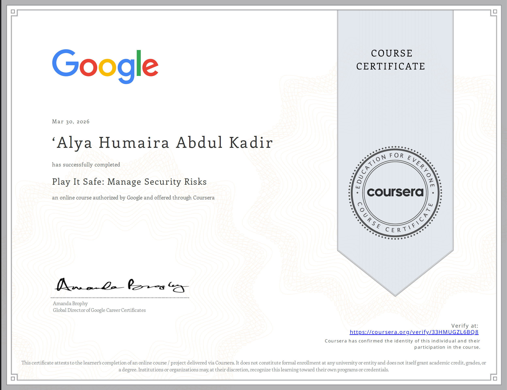

# Google Cybersecurity – Play It Safe: Manage Security Risks

This certificate is part of the Google Cybersecurity Professional Certificate program.

---

## 📜 Certificate Preview

---

## 🔗 View Full Certificate

[Click here to view the PDF](../Play%It%Safe%Manage%Security%Risks%Certificate.pdf)

---

## 🧠 Skills Learned

- Risk assessment and risk management
- Understanding security frameworks (NIST, ISO)
- Identifying threats, vulnerabilities, and impacts
- Applying security controls and mitigation strategies
- Governance, compliance, and policy awareness  

---

## 🎯 Relevance

This course strengthened my understanding of managing cybersecurity risks and applying structured security frameworks, which are essential skills for a **SOC Analyst / Cybersecurity Analyst**.
