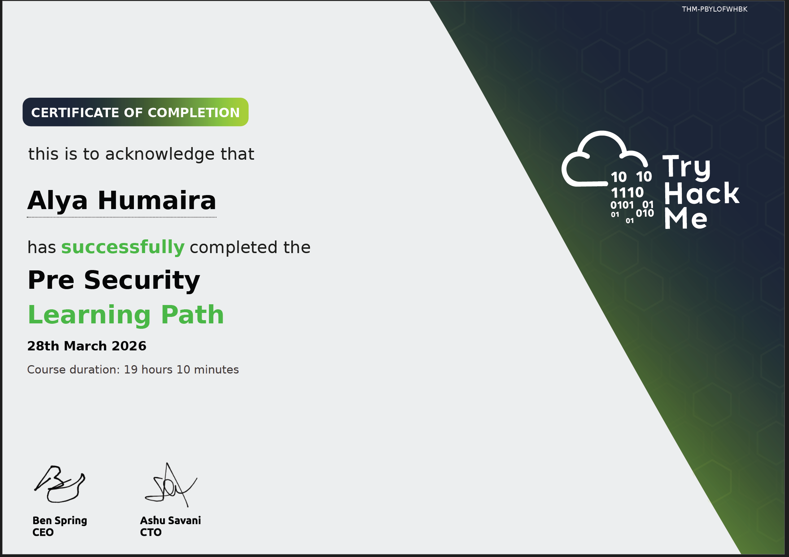

# TryHackMe – Pre Security Learning Path

This learning path provides foundational knowledge in cybersecurity, covering networking, operating systems, web technologies, and basic security concepts.

---

## 📚 Learning Path Overview

### 🖥️ Computer Fundamentals

* Inside a Computer System
* Computer Types
* Client-Server Basics

### 🌐 Network Fundamentals

* What is Networking
* Intro to LAN
* OSI Model
* Packets & Frames
* Extending Your Network

### 🌍 How the Web Works

* DNS in Detail
* HTTP in Detail
* How Websites Work

### 💻 Operating Systems Basics

* Windows Basics
* Linux CLI Basics
* Windows CLI Basics
* Operating System Security

### ⚙️ Software Basics

* Data Representation
* Data Encoding
* Python & JavaScript Basics
* SQL Basics

### 🛡️ Attacks & Defenses

* CIA Triad
* Cryptography Concepts
* Attacker vs Defender Mindset

---

## 📜 Certificate Preview

---

## 🔗 View Certificate

👉 [View Full Certificate](./THM-Pre-Security-Learning-Path-Certificate.pdf)

---

## 🧠 Skills Learned

* Networking fundamentals (OSI, TCP/IP, DNS)
* Linux & Windows command line basics
* Web fundamentals (HTTP, DNS, client-server)
* Basic scripting and database concepts
* Cybersecurity principles (CIA Triad, cryptography)
* Attacker and defender mindset

---

## 🎯 Relevance

This learning path built my foundational understanding of how systems, networks, and web technologies operate, which is essential for progressing into cybersecurity roles such as **SOC Analyst / Cybersecurity Analyst**.

