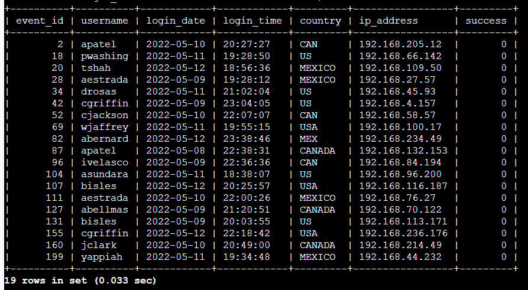
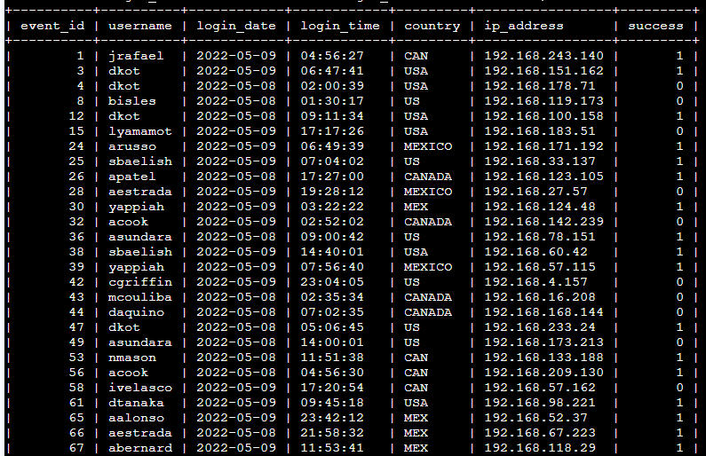
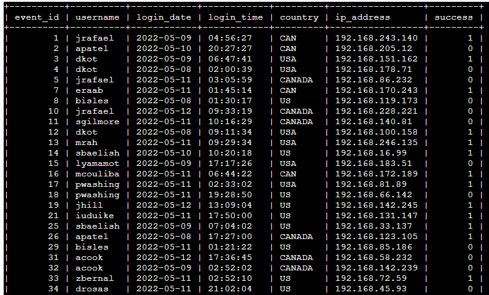
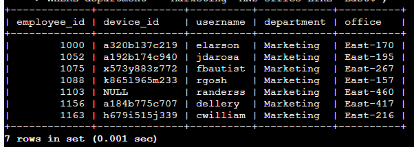
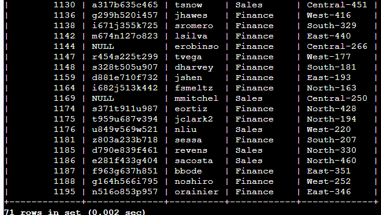
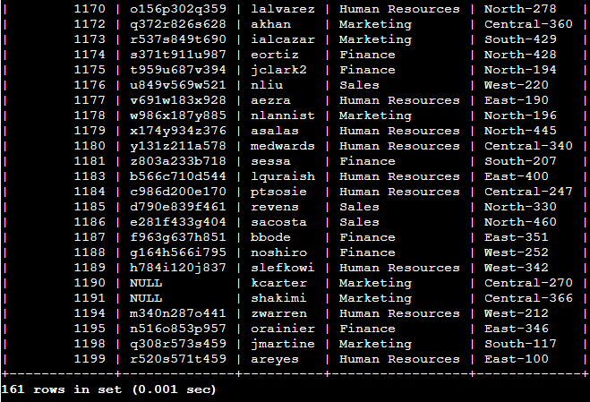

# Apply Filters to SQL Queries (Security Analysis) based from Google Cybersecurity Professional Certificate

## Project Description
This project focuses on using SQL filtering techniques to investigate potential security issues and retrieve specific employee and login data. The analysis simulates real-world tasks such as detecting suspicious login activity and identifying employees requiring system updates.

## Task 1: Retrieve after hours failed login attempts

A potential security incident occurred after business hours (after 18:00), so failed login attempts during this period needed to be investigated.

```sql
SELECT * 
FROM log_in_attempts 
WHERE login_time > '18:00' AND success = FALSE;
```

This query filters for failed login attempts after 18:00. First, all records were selected from the log_in_attempts table. Then, a WHERE clause with the AND operator was used to apply two conditions. The first condition filters login attempts after 18:00, while the second condition ensures only unsuccessful attempts are returned.

The output shows 19 rows, indicating multiple failed login attempts outside business hours.



## Task 2: Retrieve login attempts on specific dates

A suspicious event occurred on 2022-05-09, so login activity on that date and the previous day needed to be analyzed.

```sql
SELECT * 
FROM log_in_attempts 
WHERE login_date = '2022-05-09' OR login_date = '2022-05-08';
```

This query retrieves login attempts from two specific dates. First, all records were selected from the table. Then, the OR operator was used to return results matching either date condition.

The output shows 75 rows, confirming that all login attempts from both dates were successfully retrieved.



## Task 3: Retrieve login attempts outside of Mexico

Login attempts originating outside of Mexico were identified for further investigation.

```sql
SELECT * 
FROM log_in_attempts 
WHERE NOT country LIKE 'MEX%';
```

This query filters login attempts from countries other than Mexico. First, all records were selected from the table. Then, the NOT operator was used with LIKE 'MEX%' to exclude entries starting with "MEX".

The output includes login attempts from countries such as the USA and Canada.



## Task 4: Retrieve employees in Marketing

Employee machines in the Marketing department located in East offices needed to be updated.

```sql
SELECT * 
FROM employees 
WHERE department = 'Marketing' AND office LIKE 'East%';
```

This query retrieves employees in the Marketing department within East office locations. First, all records were selected from the employees table. Then, the AND operator was used to combine department and office conditions.



## Task 5: Retrieve employees in Finance or Sales

Employees in the Finance and Sales departments required a separate system update.

```sql
SELECT * 
FROM employees 
WHERE department = 'Finance' OR department = 'Sales';
```

This query retrieves employees from either department using the OR operator.

The output shows 71 rows, confirming that employees from both departments were successfully retrieved.



## Task 6: Retrieve employees not in IT

Employees outside the Information Technology department needed to be identified.

```sql
SELECT * 
FROM employees 
WHERE NOT department = 'Information Technology';
```

This query excludes employees from the IT department using the NOT operator.

The output shows 161 rows, confirming that all non-IT employees were retrieved successfully.



## Summary

This project demonstrates how SQL filtering techniques can be applied to analyze security-related data. By using logical operators (AND, OR, NOT) and pattern matching (LIKE), specific and relevant data can be extracted efficiently.
